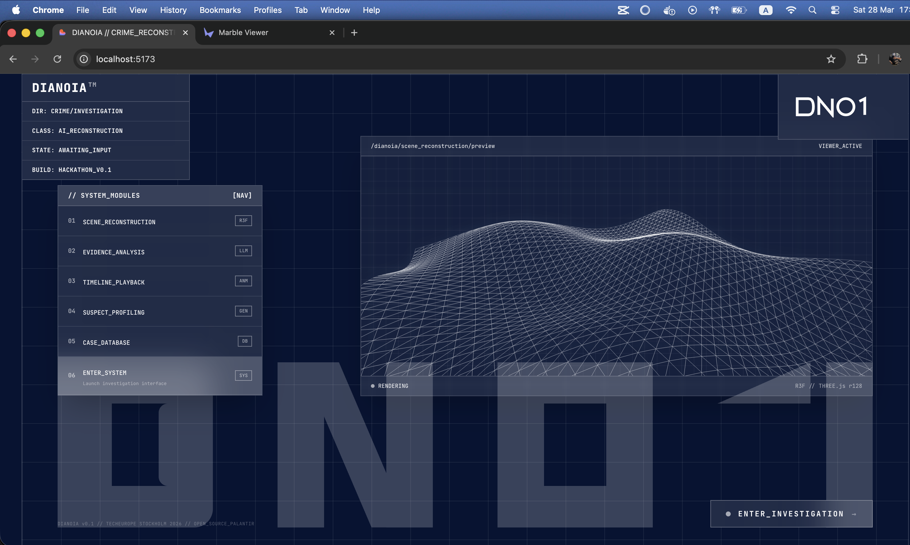

# Dianoia

**The Reasoning Mind.** Open-Source Palantir for Crime Scene Investigation.



Named after the ancient Greek concept of *dianoia* -- discursive reasoning, the faculty of stepping through evidence logically to reach conclusions.

## What is Dianoia?

An AI-powered platform that reconstructs crime scenes in 3D, reasons about evidence with credibility weighting, generates ranked timeline hypotheses of how a crime unfolded, and enables iterative suspect profiling.

### Module 1: Crime Scene Reconstruction & Reasoning

- **3D Scene Scan** -- Scan a real space with Marble API, get a photorealistic 3D reconstruction
- **AI Blueprint Generation** -- VLM analyzes the scene, LLM generates a clean 3D blueprint space
- **Evidence Placement** -- Place physical evidence, forensic reports, and witness statements in the blueprint
- **Progressive Reasoning** -- Feed evidence in stages; Gemini generates ranked timeline hypotheses with credibility weighting
- **Timeline Playback** -- Scrub through time, watch suspect movement paths in 3D, compare hypotheses

### Module 2: Suspect Profiling

- **Composite Generation** -- Witness describes suspect, NanoBanana generates initial photorealistic composite
- **Iterative Refinement** -- "Add a beard", "thinner face", "darker hair" -- each edit uses the previous image as reference
- **Profile Cards** -- Final composites saved to the case file

## Tech Stack

| Layer | Technology |
|-------|-----------|
| Frontend | React 18 / TypeScript + React Three Fiber v8 |
| 3D Scan | Marble API 0.1-mini (World Labs) |
| Backend | Go (chi router) |
| Database | Supabase (Postgres + Realtime + Storage) |
| AI Reasoning | Gemini 3 Flash |
| Image Generation | NanoBanana (gemini-2.5-flash-image) |
| Styling | Tailwind CSS + shadcn/ui + JetBrains Mono |

## Architecture

Decoupled modules communicating via Supabase real-time:

```
Frontend (React/R3F) ──REST──> Go Backend :8080 ──> Gemini / Marble / NanoBanana
                                    │
                              Writes results to Supabase
                                    │
Supabase Realtime ────push────> Frontend re-renders
```

- Frontend reads data directly from Supabase (anon key)
- Frontend sends commands to Go backend (REST API)
- Go backend orchestrates all AI calls and writes results to Supabase
- Frontend auto-updates via real-time subscriptions

## Features

| Feature | Status |
|---------|--------|
| Landing page with Three.js wireframe animation | Done |
| 3D Blueprint viewer (R3F) with orbit + pan controls | Done |
| 2D SVG Floor Plan view | Done |
| Marble 3D realistic viewer | Done |
| Evidence placement with type badges + credibility | Done |
| Gemini reasoning pipeline (progressive S0/S1/S2) | Done |
| Timeline playback with actor interpolation | Done |
| Evidence relationship graph | Done |
| NanoBanana suspect profiling (generate + refine) | Done |
| Case switcher with real-time case list | Done |
| Dark tactical UI theme (glass panels, JetBrains Mono) | Done |

## Quick Start

```bash
# 1. Clone
git clone https://github.com/inin-zou/Dianoia.git
cd Dianoia

# 2. Set up environment
cp .env.example .env
# Fill in: SUPABASE_URL, SUPABASE_ANON_KEY, SUPABASE_SERVICE_ROLE_KEY,
#          GEMINI_API_KEY, MARBLE_API_KEY

# 3. Run Supabase migrations
# Paste supabase/migrations/001_initial_schema.sql in Supabase SQL Editor
# Then paste supabase/seed.sql for demo data

# 4. Start backend
cd backend
go mod tidy
CGO_ENABLED=0 go build -o server ./cmd/server/
./server  # runs on :8080

# 5. Start frontend
cd frontend
npm install --legacy-peer-deps
npx vite --port 5173  # runs on :5173

# 6. Open http://localhost:5173
```

## Documentation

Full design docs in [`.claude/docs/overview.md`](.claude/docs/overview.md).

## Built at TechEurope Stockholm 2026

## License

MIT
